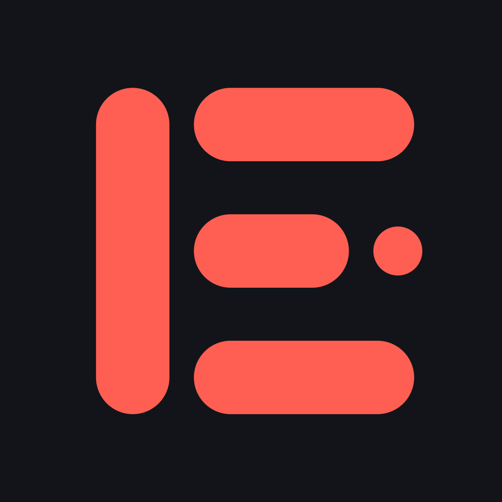

<div align="center">



# Ekko for iOS

**The app, the keyboard, and the Safari extension. Post-quantum encrypted messaging inside the apps you already use.**

[](LICENSE)
[](docs/IOS.md)
[](https://github.com/useekko/ekko-core)

[Website](https://useekko.app) · [Core repo](https://github.com/useekko/ekko-core) · [iOS contract](docs/IOS.md) · [Threat model](docs/THREAT_MODEL.md) · [Security](SECURITY.md) · [Discord](https://discord.gg/cQytJjVdxu)

</div>

---

On iOS, **the keyboard is the product.** There is no way to reach inside Instagram's
*native* app — no overlay API, no reading another app's UI. But a custom keyboard has its
own process and its own keys: what you type goes into Ekko's buffer, gets sealed on-device
with hybrid X25519 + ML-KEM-768, and only ciphertext ever touches the host app's text
field. Instagram cannot scrape a composer you never typed into.

One identity spans everything: the same 24-word recovery phrase derives the same keys
here and in the [browser extension](https://github.com/useekko/ekko-core), so a message
sealed in Chrome opens on the phone, and the reverse. That byte-compatibility is pinned
by committed interop vectors (`ios/EkkoCore/Tests/EkkoCoreTests/vectors.json`), generated
from the TypeScript core.

## Status: public alpha, TestFlight next

The app, the keyboard, and the Safari extension build, pass their tests, and run on our
own devices. What's missing is distribution: **TestFlight is blocked on Apple Developer
paperwork, not on code.** If you've shipped a keyboard extension through App Review
before and have advice — or war stories — the [Discord](https://discord.gg/cQytJjVdxu)
is where we'd love to hear them.

Until then, this repo is how the iOS half is used: build it yourself in Xcode, on a
simulator or your own device. The core is free and stays free, and there is no telemetry
in any of it — the keyboard makes **no network requests at all**, and a test
(`NoNetworkTests`) greps everything it links to keep that sentence true.

## What's in here

| | |
|---|---|
| `ios/Ekko` | The SwiftUI app: identity, 24-word backup, contacts, people, profiles, account sync. |
| `ios/EkkoKeyboard` | The custom keyboard. Sealing happens here; plaintext never reaches the host app. |
| `ios/EkkoCore` | A Swift port of the TypeScript core (local SPM package). **Zero crypto dependencies** — CryptoKit's ML-KEM-768 on iOS 26, plus a hand-written XChaCha20-Poly1305 on top of it. |
| `ios/EkkoSafari` | The Safari web extension target (its web payload is generated from ekko-core's build). |
| `ios/KeyboardLab` | A lab app that pixel-compares Ekko's key plane against Apple's real keyboard. |
| `docs/` | `IOS.md` is the contract: the three targets, the traps, the proof commands. |

## Building it (Xcode 26+)

```bash
open ios/Ekko.xcodeproj
```

Set your own `DEVELOPMENT_TEAM` in `ios/project.yml` — and always edit `project.yml`,
never the `.pbxproj` (regenerate with `cd ios && xcodegen generate`;
`brew install xcodegen` if you don't have it).

Tests:

```bash
cd ios/EkkoCore && swift test    # the core + the committed cross-language interop vectors
```

The keyboard and UI test suites run from Xcode (`EkkoKeyboardTests`, `EkkoUITests` — the
one named "locked keystrokes never reach the host app's text field" is the test that
matters). To drive the keyboard end to end in a simulator:

```bash
scripts/ios-sim-setup.sh        # registers the keyboard, the way Settings would
scripts/ios-reset-sim.sh        # clean-slate: also clears the App Group vault
scripts/ios-install-device.sh   # sideload onto your own iPhone
```

The Safari extension target's `Resources/` payload is generated from
[ekko-core](https://github.com/useekko/ekko-core) (`npm run ios:safari` there) — the
app, the keyboard, and EkkoCore build and test without it.

## The traps that each cost a day (read before they cost you one)

1. **`CODE_SIGNING_ALLOWED: NO` silently kills the App Group.** Entitlements never get
   embedded, the app falls back to a temp directory, and the keyboard can never see the
   vault. Nothing errors. It must stay `YES`.
2. **Full Access is mandatory** — iOS blocks App Group reads without it. The app says so
   honestly, and the no-network test is what makes that honesty safe.
3. **iOS 26 is the floor because ML-KEM landed in CryptoKit there.** `apple/swift-crypto`
   is the documented escape hatch if we ever need to go lower.
4. **Edit `ios/project.yml`, never the `.pbxproj`.** The project file is generated.

## Contributing, feedback & security

Start with [`CONTRIBUTING.md`](CONTRIBUTING.md). Ideas and questions go in
[Discussions](https://github.com/useekko/ekko-ios/discussions) or the
[Discord](https://discord.gg/cQytJjVdxu); the [newsletter](https://useekko.app/#get) is
the low-noise way to follow the rollout, including TestFlight when it opens.

Found a vulnerability? **Don't open an issue** — see [`SECURITY.md`](SECURITY.md).

## License

**GPL-3.0** ([`LICENSE`](LICENSE)).

---

<div align="center">

Because convenience was never meant to sacrifice privacy.

[useekko.app](https://useekko.app) · [x.com/useekko](https://x.com/useekko) · [Discord](https://discord.gg/cQytJjVdxu)

</div>
